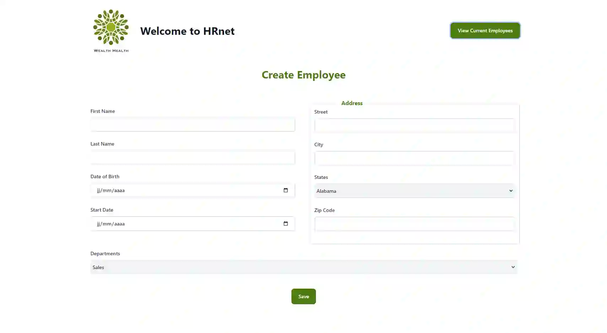
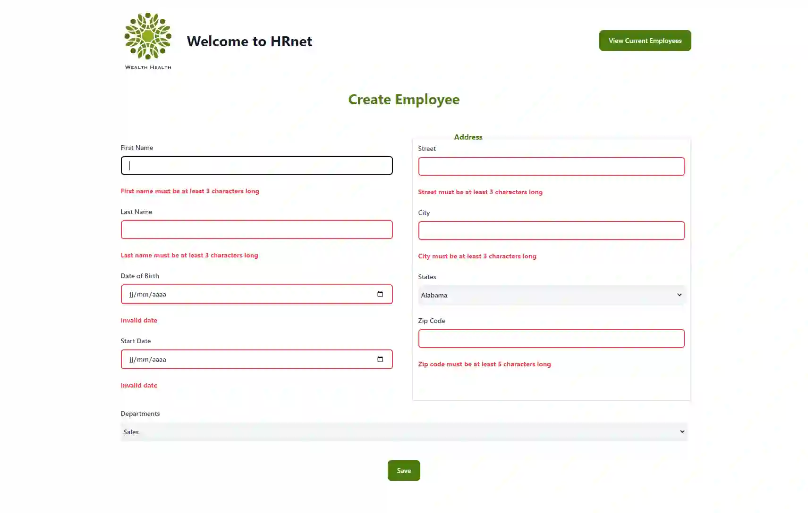
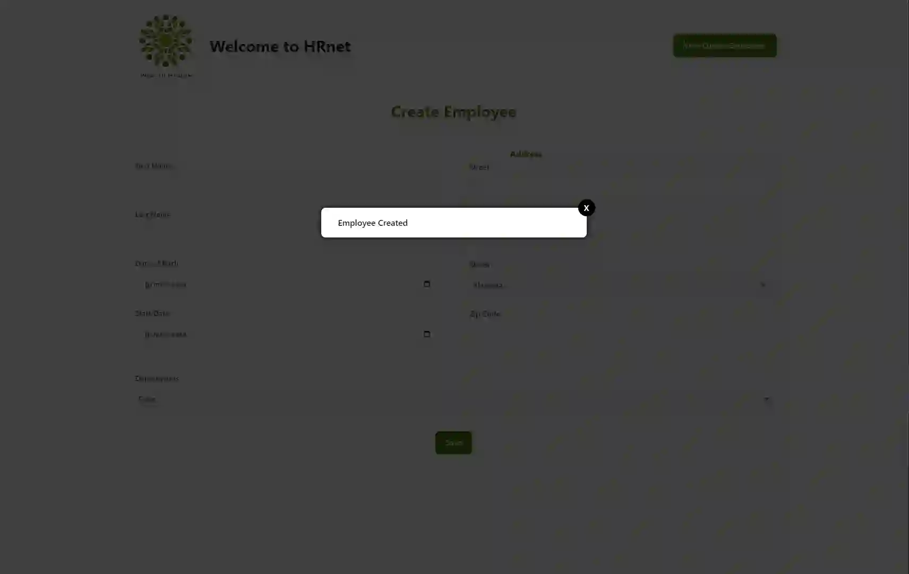
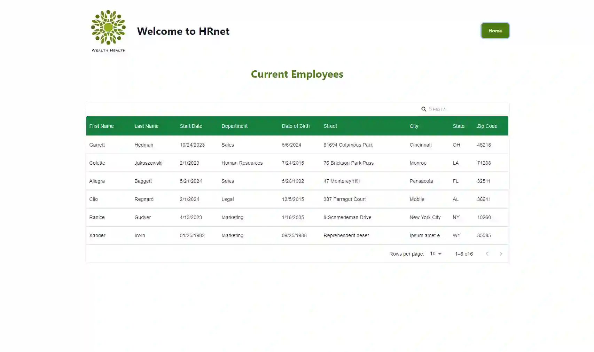

# HRNet


[](https://www.linkedin.com/in/alec-remond/)

Project 14 from JavaScript React developper path at OpenClassrooms

## Launch the project

```bash
git clone https://github.com/rockethelll/P14-HRNet
cd P14-HRNet
npm install
npm run dev
```

You can see the site at : <http://localhost:5173>

## Testing the application

Tests end to end are used to check the application with cypress:

- Access to home page
- Check error displayed if invalid fields on the form
- If input fields are ok, test if the modal is displayed
- Navigate to the employees pages
- Check if the user previously created is on the table

```bash
npm cy:open
```

## Tech Stack

**Client:** React, Redux, Tailwindcss

## Screenshots





